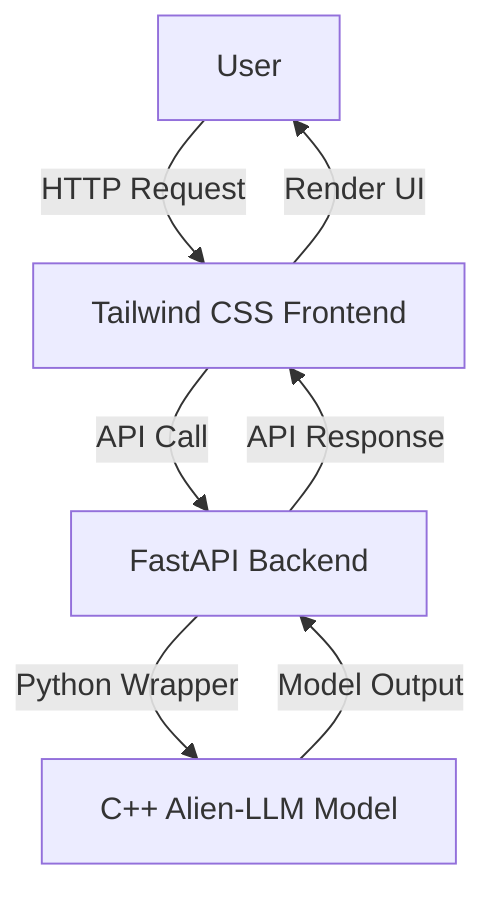

# Architecture and Implementation Plan

This document outlines the architecture and implementation plan for integrating the `Alien-LLM` C++ model with a FastAPI backend and a Tailwind CSS frontend, adhering to the user's requirements.

## 1. Overall Architecture

The system will consist of three main components:

1.  **C++ Model (Alien-LLM):** The core LLM logic, written in C++.
2.  **FastAPI Backend:** A Python API that wraps the C++ model, handles chat requests, and serves the static frontend files.
3.  **Tailwind CSS Frontend:** A vanilla HTML, CSS (Tailwind), and JavaScript application providing the user interface.



## 2. C++ Model Integration (Python Wrapper)

To integrate the existing C++ `Alien-LLM` model with the Python FastAPI application, the C++ code will be compiled into a shared library (`.so` for Linux). Python's `ctypes` library will then be used to load this shared library and call the C++ functions.

### 2.1 Compilation Steps

1.  **Compile C++ to Shared Library:** The `main.cpp` and other relevant C++ files (e.g., `orchestrator.hpp`, `tokenizer.hpp`) will be compiled into a shared library, exposing key functions like model loading, tokenization, encoding, decoding, and the `process_token` function.
    *   A `CMakeLists.txt` modification might be necessary to build a shared library instead of an executable.

### 2.2 Python `ctypes` Wrapper

1.  **Load Shared Library:** The Python wrapper (`interface.py`) will load the compiled shared library.
2.  **Expose C++ Functions:** Functions for initializing the model, loading checkpoints, encoding/decoding tokens, and generating responses will be exposed via `ctypes`.
3.  **Data Conversion:** Handle conversion between Python strings/lists and C++ data types (e.g., `std::string`, `std::vector<int>`).

## 3. FastAPI Backend

The FastAPI application will serve as the bridge between the frontend and the C++ model.

### 3.1 File Structure

```
Alien-LLM/
├── backend/
│   ├── main.py             # FastAPI application
│   ├── interface.py        # Python wrapper for C++ model
│   └── requirements.txt    # Python dependencies
├── frontend/
│   ├── index.html          # Main chat interface
│   ├── documentation.html  # Documentation page
│   ├── styles.css          # Compiled Tailwind CSS
│   ├── script.js           # Frontend JavaScript logic
│   └── tailwind.config.js  # Tailwind CSS configuration
├── model_checkpoint.bin    # Pre-trained model checkpoint
├── datasets/               # Model datasets
├── src/                    # Original C++ source files
├── include/                # Original C++ header files
└── CMakeLists.txt          # C++ build system
```

### 3.2 Endpoints

*   **`/` (GET):** Serves `index.html` (the main chat interface).
*   **`/docs` (GET):** Serves `documentation.html`.
*   **`/chat` (POST):** Accepts user messages, passes them to the C++ model via the Python wrapper, and streams back the model's response.
    *   **Request Body:** `{"message": "user_message_here"}`
    *   **Response:** Streaming text, similar to how LLMs respond token by token.
*   **`/health` (GET):** A simple health check endpoint.
*   **Static Files:** FastAPI will be configured to serve static files (CSS, JS, images) from the `frontend/` directory.

## 4. Tailwind CSS Frontend (No React)

The frontend will be built using vanilla HTML, Tailwind CSS for styling, and plain JavaScript for interactivity.

### 4.1 Pages

1.  **`index.html` (Chat Interface):**
    *   **Layout:** Sidebar for navigation, main content area for chat.
    *   **Chat Area:** Message display, user input field, send button.
    *   **Splash Screen:** A simple loading animation that appears on initial load and disappears once the model is ready.
    *   **Psychological Design:** Subtle animations for message entry/exit, typing indicators, and thoughtful spacing to enhance user experience.

2.  **`documentation.html` (Documentation Page):**
    *   Content explaining the model, its capabilities, and how to use the interface.
    *   Styled with Tailwind CSS.

### 4.2 Styling and Animations

*   **Tailwind CSS:** Used for all styling, ensuring a consistent and modern look.
*   **Animations:**
    *   **Splash Screen:** Fade-in/fade-out animation.
    *   **Page Transitions:** Professional morph transitions between `index.html` and `documentation.html` using JavaScript and CSS animations (e.g., `View Transitions API` if supported, or custom CSS transforms/opacity changes).
    *   **UI Elements:** Subtle hover effects, input focus animations, and message entry animations.
*   **Shadows:** Extensive use of Tailwind's shadow utilities for depth and visual hierarchy.

### 4.3 JavaScript Interactivity

*   **Chat Logic:** Handle sending messages to the FastAPI `/chat` endpoint, receiving and displaying streaming responses.
*   **Sidebar Toggle:** JavaScript to open/close the sidebar.
*   **Navigation:** Handle client-side navigation between `index.html` and `documentation.html` to enable morph transitions.
*   **Animations:** Trigger and manage CSS animations for splash screen, page transitions, and UI elements.

## 5. Vercel Deployment

### 5.1 `vercel.json` Configuration

*   **Root Endpoint:** The root path (`/`) will be configured to serve the FastAPI application, which in turn will serve `index.html`.
*   **Rewrites/Redirects:** Ensure that all frontend assets (CSS, JS) and other API endpoints are correctly routed.
*   **Build Command:** Specify the command to build the Tailwind CSS and potentially compile the C++ shared library (if Vercel build environment allows).

## 6. Development Workflow

1.  **Compile C++:** Compile the C++ model into a shared library.
2.  **Develop Python Wrapper:** Create `interface.py` to interact with the shared library.
3.  **Develop FastAPI:** Implement `main.py` with API endpoints and static file serving.
4.  **Develop Frontend:** Build `index.html`, `documentation.html`, `styles.css`, and `script.js`.
5.  **Local Testing:** Test the integrated system locally.
6.  **Vercel Configuration:** Set up `vercel.json`.
7.  **Push to GitHub:** Push the entire project to the GitHub repository for Vercel deployment.
